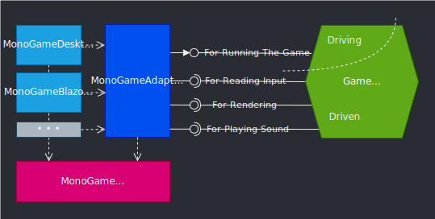
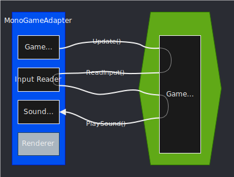
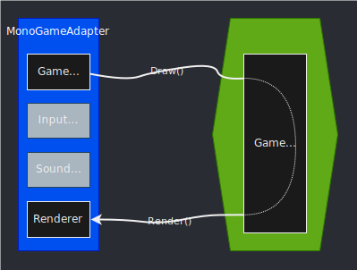
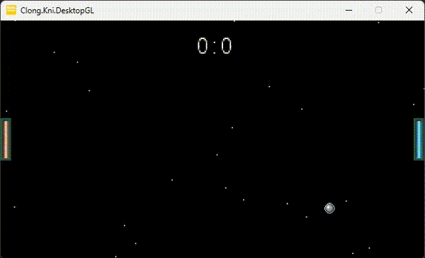

# Clong

An implementation of a video game that simulates table tennis with rotating gravity using MonoGame and Hexagonal Architecture (a.k.a. Ports & Adapters).

There's also a blog post: https://shendriks.dev/posts/2024-12-30-making-game-logic-framework-independent-with-hexagonal-architecture/

## The Architecture

## Control Flow(s)
### Control Flow for Update

### Control Flow for Draw

## See it in Action

Or play on itch.io: https://shendriks.itch.io/clong
